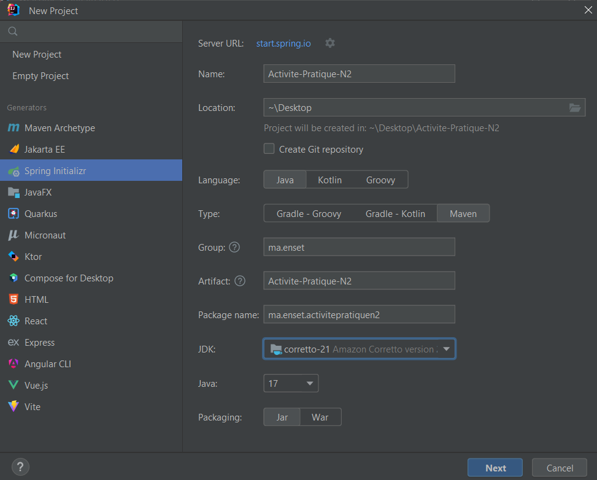
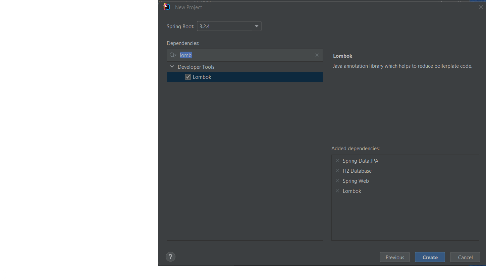
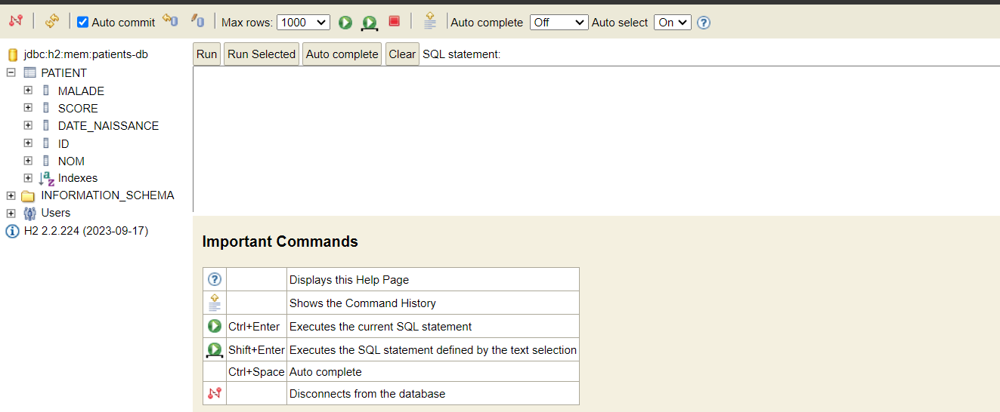
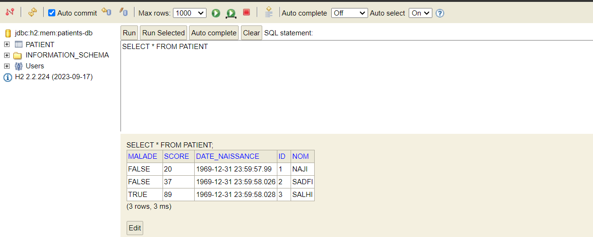
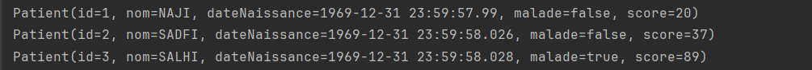
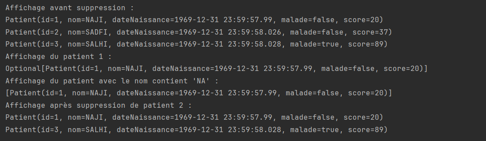
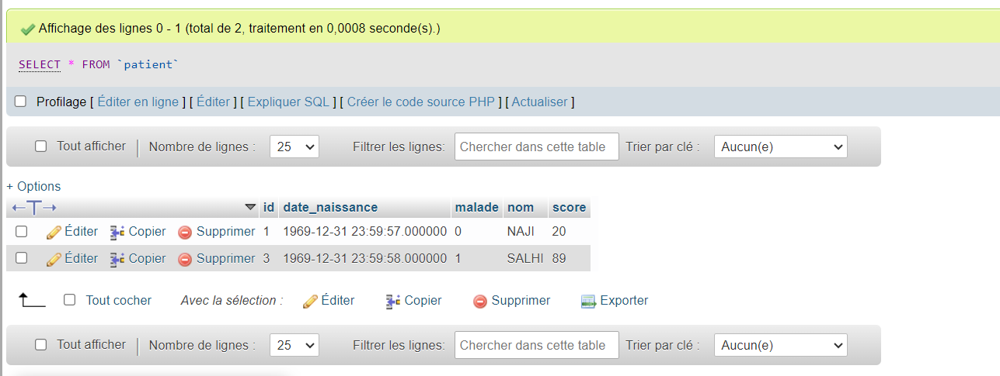

# TP N°2 : Application de Gestion des Patients avec Spring Boot

## Objectif

Le but de ce projet était de créer une application de gestion des patients en utilisant Spring Boot avec une base de données H2 intégrée, et de migrer cette application vers MySQL.

## Étapes réalisées

1. **Installation de l'environnement de développement** :
    - Téléchargement et installation de IntelliJ IDEA Ultimate.
    - Configuration de l'environnement de développement.

2. **Création du projet Spring Boot** :
    - Utilisation de Spring Initializr pour créer un nouveau projet avec les dépendances JPA, H2, Spring Web et Lombok.
      
    - L'ajout des dépendences:
      
3. **Création de l'entité JPA Patient** :
    - Ajout de la classe `Patient` avec les attributs requis (id, nom, dateNaissance, malade, score).
    ```java
     package ma.enset.activitepratiquen2.entities;
     import jakarta.persistence.Entity;
     import jakarta.persistence.GeneratedValue;
     import jakarta.persistence.GenerationType;
     import jakarta.persistence.Id;
     import lombok.*;

     import java.util.Date;


     @Data @NoArgsConstructor @AllArgsConstructor @Getter @Setter
     @Entity
     public class Patient {
     @Id
     @GeneratedValue(strategy = GenerationType.IDENTITY)
     private Long id;

     private String nom;

     private Date dateNaissance;

     private boolean malade;

     private int score;

     }
     ```
4. **Configuration de l'unité de persistance** :
    - Modification du fichier `application.properties` pour configurer la base de données H2.
     ```java
   server.port=8085
   spring.datasource.url=jdbc:h2:mem:patients-db
   spring.h2.console.enabled=true
    ```
    - 
   
5. **Création de l'interface JPA Repository** :
    - Création de `PatientRepository` étendant `JpaRepository`.
    ```java
       package ma.enset.activitepratiquen2.repository;

       import ma.enset.activitepratiquen2.entities.Patient;
       import org.springframework.data.jpa.repository.JpaRepository;

       import java.util.List;

       public interface PatientRepository extends JpaRepository<Patient, Long> { 
       }
   ```
6. **Implémentation des fonctionnalités CRUD** :
    - Ajout, consultation, mise à jour et suppression des patients.
    - **L'ajout**
      
    - **Cnsultation**
        
   - **Cnsultation par id**
     
   - **Suppression**
     

   - **Code source de l'application :**
   ```java
       package ma.enset.activitepratiquen2;

       import ma.enset.activitepratiquen2.entities.Patient;
       import ma.enset.activitepratiquen2.repository.PatientRepository;
       import org.springframework.beans.factory.annotation.Autowired;
       import org.springframework.boot.CommandLineRunner;
       import org.springframework.boot.SpringApplication;
       import org.springframework.boot.autoconfigure.SpringBootApplication;

       import java.util.Date;
       import java.util.List;

       @SpringBootApplication
       public class ActivitePratiqueN2Application implements CommandLineRunner {
       @Autowired
       private PatientRepository patientRepository;
       public static void main(String[] args) {

          SpringApplication.run(ActivitePratiqueN2Application.class, args);
       }

       @Override
       public void run(String... args) throws Exception {
          patientRepository.save(new Patient(null, "NAJI",new Date(04-12-2002),false,20));
          patientRepository.save(new Patient(null, "SADFI",new Date(29-04-1999),false,37));
          patientRepository.save(new Patient(null, "SALHI",new Date(12-04-1980),true,89));
          List<Patient> patients = patientRepository.findAll();
          System.out.println("Affichage avant suppression :");
          patients.forEach(patient -> System.out.println(patient.toString()));
          System.out.println("Affichage du patient 1 :");
          System.out.println(patientRepository.findById(1L).toString());
          System.out.println("Affichage du patient avec le nom contient 'NA' :");
          System.out.println(patientRepository.findByNomContains("NA"));

          patientRepository.deleteById(Long.valueOf(2));
          System.out.println("Affichage après suppression de patient 2 :");
          patients = patientRepository.findAll();
          patients.forEach(patient -> System.out.println(patient.toString()));

       }
      }
   ```
     - **Modification du PatientRepository :**
   ```java
       package ma.enset.activitepratiquen2.repository;

       import ma.enset.activitepratiquen2.entities.Patient;
       import org.springframework.data.jpa.repository.JpaRepository;

       import java.util.List;

       public interface PatientRepository extends JpaRepository<Patient, Long> { 
          List<Patient> findByNomContains(String nom);
          public void deleteById(Long id);
       }
   ```
7. **Migration vers MySQL** :
      
    - l'ajout de dépendence mysql
    ```xml
      <dependency>
      <groupId>com.mysql</groupId>
      <artifactId>mysql-connector-j</artifactId>
      <scope>runtime</scope>
      </dependency>
      ```
    - Modification du fichier `application.properties` pour utiliser MySQL.
     ```properties
     server.port=8085
     spring.datasource.url=jdbc:mysql://localhost:3306/patients-db?createDatabaseIfNotExist=true
     spring.datasource.username=root
     spring.datasource.password=
     spring.jpa.hibernate.ddl-auto=update
     spring.jpa.properties.hibernate.dialect=org.hibernate.dialect.MariaDBDialect
      ```
   
    